# Car Dealer Demo #
-----
## 사전 준비사항 ##
+ Oracle Cloud Trial Account
+ Postman 툴 ([다운로드](https://www.getpostman.com/apps))

## 소개 ##
이번 Lab은 Oracle BlockChain를 활용하여 Car Dealer 회사에서 자동차 매매에 투명성을 확보할 수 있도록 해주는 Lab 입니다.

## Lab 시나리오
대형 자동차 회사는 딜러 / 구매자의 공급망을 관리하는 소프트웨어(SCM)을 원장 (blockchain)에 권한을 부여하는 방식으로 공급망 시스템을 간소화하는 것을 목표로 하고 있습니다. 최종 목표는 조정하는 노력과 차량 및 부품에 대한 감사 추적 설정과 관련된 전반적인 마찰을 줄이는 것입니다.
딜러가 서로 경쟁 할 수 있으므로 분명히 다른 딜러가 거래의 세부 정보를 보기를 원하지 않습니다 (또는 심지어 거래를 하고 있음에도 불구하고). Blockchain 클라우드 서비스에서는 채널을 사용하여 트랜잭션을 서로 분리하고 해당 채널을 볼 수 있는 동료(peer)만 해당 트랜잭션을 볼 수 있게 함으로써 이를 해결해줍니다.
시나리오에서는 아래 그림과 같이 중앙에 제조업체 (Detroit Auto)와 두 명의 딜러 (Sam 과 Jude를 만들고 채널별로 
구분합니다.

이 채널들은 차량 제조업체와 특정 딜러 만 볼 수 있는 별도의 원장을 각각 갖게 됩니다. 채널은 2 개가 아닌 여러 참여자를 가질 수 있고, 네트워크는 더 많은 조직 (예 : 여러 다른 부품 제조업체)을 가질 수 있지만, 이 시나리오에서는 간단한 모델만으로도 충분합니다.

# Lab 시작

## 1. Multi-party Blockchain Network 구성하기
### A. 인스턴스 생성하기

1. OABCS(Oracle BlockChain Cloud Service) Console 에 접속하기  
OABCS에 접속하기 위해서는 Cloud Console에서 다음과 같이 선택해서 Open Service Console을 클릭합니다.
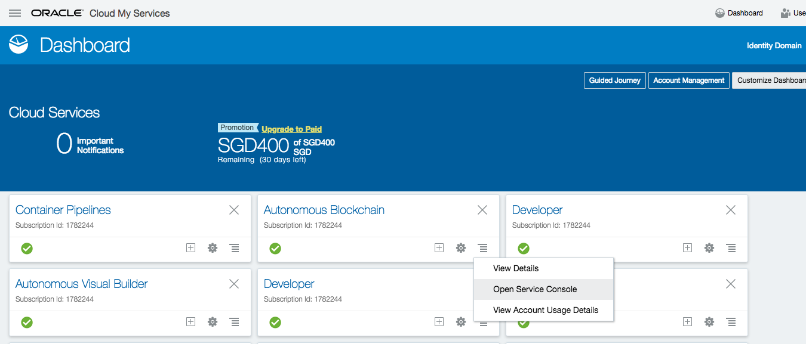

2. Organization(조직) 생성하기 Provisioning
처음 접속을 한 경우에는 아래와 같이 나오게 됩니다.  
오른쪽에 있는 인스턴스 생성 버튼을 누릅니다.

3. 이제 메인이 되는 DetroitAuto의 BlockChain Network를 만들 예정입니다.  
서비스 이름을 detroitauto 라고 입력한 후 Next 버튼을 누릅니다.  
서비스 이름은 모두 소문자로 입력하셔야 합니다.

4. Next를 누른후 다음 화면에서 Confirm 버튼을 누릅니다.
몇 분 후에 아래와 같이 인스턴스가 생성이 되게 됩니다.

5. 오른쪽의 햄버거 버튼을 클릭 한 후에 Autonomous Blockchain Console을 선택합니다.

6. 새롭게 생성된 detroitauto Founder의 Console 화면으로 이동합니다.

7. 다시 Autonomous Blockchain Cloud 화면으로 이동합니다.

8. 이번에는 다른 Dealer들을 Participant(Organization)로 만드는 과정을 구성해보도록 하겠습니다. 
인스턴스 생성을 클릭해서 생성화면으로 이동한 후 아래와 같이 정보를 입력합니다.
먼저 Jude Dealer를 생성하도록 하겠습니다.
여기서는 새로운 네트워크를 생성하는 Founder가 아니기 때문에 Create a new Network 체크를 해제 합니다.
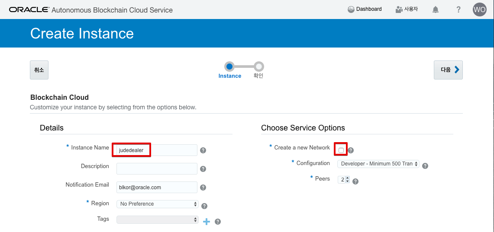

9. 동일한 과정을 거쳐 Sam Dealer 를 생성하도록 하겠습니다.

### B. Founder에 JudeDealer Participant 조직(Organization)을 Join하기
1. 네트워크가 생성되면 각각의 관리 콘솔에 액세스 할 수 있습니다.  
먼저 judedealer 의 콘솔에 접속합니다.

2. Founder는 Participant Org의 두 가지 정보가 필요합니다. 첫째는 참가하는 Org를 검증 하기 위한 인증서가 필요하고, 두번째는 Org에서 관리하는 피어 노드에 대한 정보입니다. 피어 정보는 이후 프로세스까지 필요하지 않습니다.
Participant의 인증서를 가져오기 위해 Participant Org의 콘솔을 엽니다. 네트워크 탭에서 햄버거 메뉴를 클릭하고 딜러 조직에서 '인증서 내보내기'를 선택하여 인증서를 내보낼 수 있습니다. 내보낸 파일을 저장하십시오.

3. Export 버튼을 눌러 judedealer-certificates.json 파일을 서버로 부터 로컬 컴퓨터에 다운로드 합니다.  
접속하고자 하는 Founder의 Orderer 정보를 import 해야 합니다. Import Orderer Settings를 클릭합니다.

4. "DetroitAuto" Founder 조직의 콘솔로 이동해서 "네트워크" 탭을 선택하십시오. 그런 다음 "DetroitAuto" 조직의 햄버거 메뉴를 클릭하여 Orderer 설정파일을(detroitauto-orderer-settings.json) 내보냅니다. 내보낸 파일을 저장하십시오.

5. 다시 judedealer 조직의 콘솔로 이동해서 Upload Orderer Settings 를 클릭합니다.

6. 위에서 다운로드 한 detroitauto-orderer-settings.json 를 선택합니다.

7. 선택한 파일이 정상적으로 upload 되면, 이 파일을 Import를 클릭해서 반영합니다. 마지막으로 Complete 단계를 클릭합니다.

8. 이제 Judedealer의 메인화면이 정상적으로 열립니다.

9. 이제 지금까지 JudeDealer를 구성했고, JudeDealer에 대한 정보도 얻었습니다. 일반적으로 이 프로세스는 단일 사용자가 수행하지 않으며 대신 새로운 조직을 Blockchain 네트워크에 탑재하기 위해 메타 데이터를 전송해야 합니다. Oracle Blockchain Cloud Service는 서로 알려진 조직에게만 액세스 권한이 부여되는 'permissioned' 네트워크이며, 지금 하고 있는 작업을 통해 활성화가 되게 됩니다.

    Founder에도 JudeDealer를 추가해주어야 합니다. Founder 콘솔의 Network로 이동해서 Add Organizations 버튼을 클릭합니다.

10. Upload Organization Certificates 버튼을 클릭한 후 앞에서 다운로드 한 judedealer-certificates.json 파일을 선택하고 Add 버튼을 눌러 Org를 추가합니다.

11. 다음과 같이 judedealer 가 Participant로 정상적으로 등록된 것을 확인할 수 있습니다.

### C. Founder에 SamDealer Participant 조직(Organization)을 Join하기
위와 동일한 방식으로 SamDealer Org를 Founder에 추가합니다. 

### D. Channel 생성하기
Multi-Party 블록 체인 네트워크를 설정하는 마지막 단계는 각 딜러의 거래를 다른 딜러의 거래와 분리하기 위해 각 딜러의 채널을 만드는 것입니다. 이 시나리오에서는 두 명의 각 대리점을 위한 별도의 채널을 만들 것입니다.

1. Channel 생성  
먼저 Founder Org의 콘솔에서 "Channels" 탭으로 이동하십시오. 그런 다음 "Create a New Channel"를 클릭하십시오. '<dealer> channel'이라는 (예 : 'samchannel'과 'judechannel') 채널을 만들면 됩니다. 각 채널에 대해 ReaderWriter가 포함되어 있고 Detroit Auto Peer의 피어가 모두 채널에 가입되어 있는지 확인하십시오.

2. Participant nodes에서 채널에 참가하기  
이 채널들은 현재 Detroit Auto의 피어 노드만을 포함합니다. 딜러들은 참여하는 노드가 없으므로 이 채널에서 트랜잭션을 만들거나 트랜잭션을 볼 수 없습니다. 그러나 조직이 채널 생성시에 채널에 피어를 추가 할 수 있습니다.
생성 된 채널에 참여하려면 Participant Org의 콘솔에 액세스하십시오. "Nodes" 탭으로 이동하여 각 피어 노드(peer0-1, pee0-2)에 대하여 햄버거 메뉴를 클릭 한 다음 "Join New Channels"를 선택하십시오.
채널 이름을 묻는 대화 상자가 표시됩니다. 각 피어에 대해 채널 이름 ( 'samchannel'또는 'judechannel')을 적절하게 입력 한 다음 'Join'을 클릭하십시오.

3. 다른 모든 peer에 대해서도 동일하게 수행합니다.
   
    * judedealer Org의 콘솔에서도 위와 동일한 작업을 수행합니다.

1. Endorsing을 위한 Participant 정보를 Founder에 추가하기
   
Founder가 다른 Org를 Transaction 의 endorser로 포함 시키려면 다른 피어 노드에 대해 알아야합니다. 이렇게 하기 위해 우리는 노드 정보를 내보내고 Founder에서 가져옵니다.
Participant Org에서 "Nodes" 탭으로 이동 한 다음 "Export / Import" 버튼을 클릭하여 노드 정보를 내 보냅니다. Participant의 Peer를 모두 선택한 다음 "Export"를 클릭하고 결과 파일을 저장합니다.
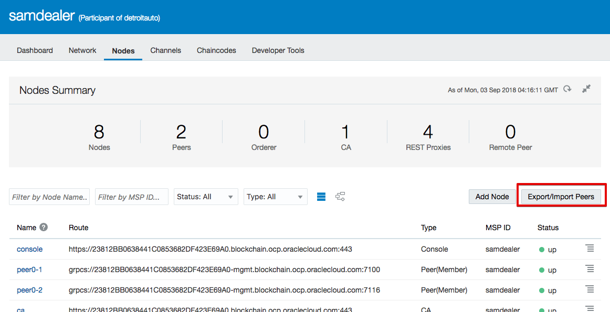

다른 Participant에 대해서도 이 과정을 반복하십시오.

위에서 노드 정보 내보내기를 완료한 후에, Founder 화면에서 "Export / Import" 버튼과 "Import" 옵션을 통해 "Node"탭에서 가져올 수 있습니다. 위에서 Export한 원격 노드 구성의 두 세트를 모두 업로드하십시오. 

프로세스가 정상적으로 완료되면 다른 Org의 Peer 노드가 목록에 나타나야 합니다. MSP(Membership Service Provider)를 통해 네트워크에 속한 조직을 추적할 수 있습니다.

1. Network구성 Review하기
지금까지 구축한 네트워크에 대한 구성도를 Founder "Nodes" 탭으로 이동하여 확인할 수 있습니다. Dealer의 피어 노드뿐 아니라 Detroitauto 노드가 목록에 있는지 확인하십시오. 
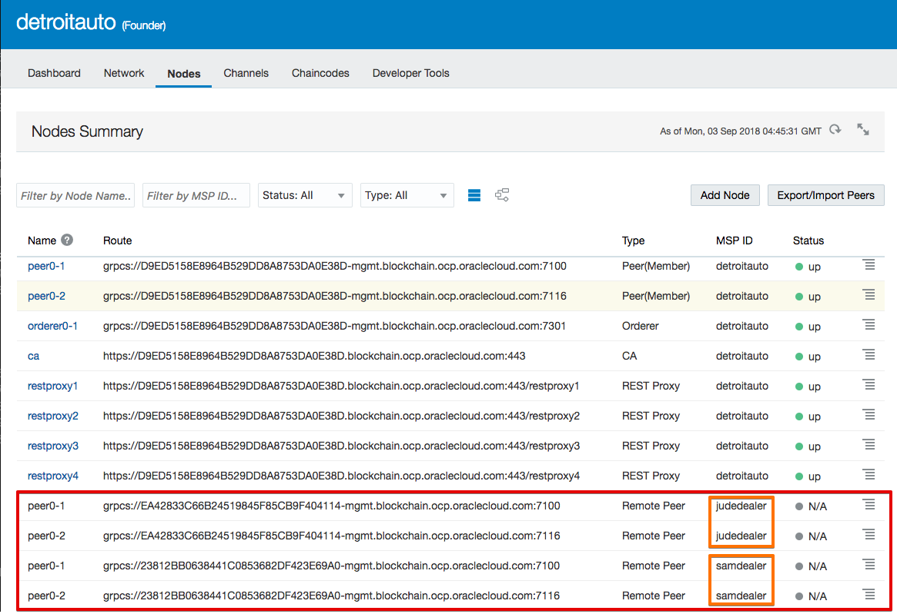

그런 다음 아래 그림의 빨간색으로 표시된 토폴로지 보기 버튼을 클릭하십시오.

이 네트워크 구성도는 이 Lab에서 처음에서 계획한 것과 유사합니다 (내부 채널로 detroitautoorderer가 추가됨). 토폴로지가 여기에 표시된 것과 같지 않거나 피어가 목록에 없으면 누락 된 항목을 확인한 다음 해당 구성 요소를 가져오거나 내보내거나, 채널 구성을 확인하십시오.

## 2. 체인코드 배포하기

### A. 체인코드 배포
지금까지 네트워크를 구축했지만 아직 아무것도 하지 않았습니다. Chaincode는 블록체인 위에서 돌아가는 코드 입니다. Chaincode에서는 데이터 유형을 정의하고, 트랜잭션을 어떻게 실행할지에 대한 로직을 정의하고, 실행되는 조건을 검증하게 됩니다. Chaincode는 응용 프로그램에서 실행하는 트랜잭션을 통해 원장 상태를 초기화 하고 관리합니다. 체인 코드는 일반적으로 네트워크 구성원이 동의한 비즈니스 로직을 처리하므로 "Smart Contract" 이라고도 합니다.
Chaincode는 golang (GO로도 알려짐)으로 작성되었지만, golang에 익숙하지 않은 경우 너무 걱정하지 않아도 됩니다. 이 데모에서는 chaincode carTrace.zip를 제공합니다.

[carTrace.zip 다운로드](https://github.com/OracleCloudKr/Blockchain_Workshop/raw/master/CarDealerLab/artifacts/carTrace.zip)

1. Founder에 체인코드 인스톨 & 초기화 
   
체인 코드를 설치하려면 Founder Org의 콘솔에서 "Chaincodes"탭으로 이동 한 다음 "Deploy a New Chaincode" 버튼을 클릭하십시오. 여기에서 로컬 컴퓨터에서 가져 오거나, 자동화 된 빌드 프로세스의 마지막 단계인 Rmote URL을 참조하여 체인 코드를 업로드 할 수 있습니다.

체인 코드를 설치하는 데는 두 가지 옵션이 있습니다. 한 번 클릭으로 체인 코드를 설정하고 여러 가지 기본값을 포함하도록 설계된 'Quick Deploy' 또는 체인 코드 설정 프로세스에 대한 보다 세부적인 제어를 위한 고급 옵션이 있습니다.
이 Lab에서는 고급 옵션을 사용하여 프로세스를 단계별로 수행하고 각 설정의 의미를 설명하지만 대부분의 개발 시나리오에서 빠른 배포로 하시면 됩니다.
고급 체인 코드 배포의 첫 번째 단계에서는 연관된 peer 각각에 체인 코드를 설치합니다. 이를 위해 우리는 chaincode 이름 (여기서 우리는 'carTrace'를 사용하고 있습니다), 버전 (v1) 그리고 어느 피어를 배포 할 것인지를 입력 할 수 있습니다. 이 경우 모든 peer에게 배포 할 예정이지만, Transaction을 검증하는 peer와 Ledger 사본을 단순히 저장하는 peer가 있습니다. (빠른 배포는 모든 peer에게 배포됩니다). chaincode가 들어있는 제공된 carTrace.zip의 사본을 업로드 할 수도 있습니다.
주의 : 체인 코드가 설치된 모든 Org에서 유일하게 유지되므로 체인 코드 이름에 주의하십시오.

첫 번째 화면은 다음과 같이 나오게 됩니다.

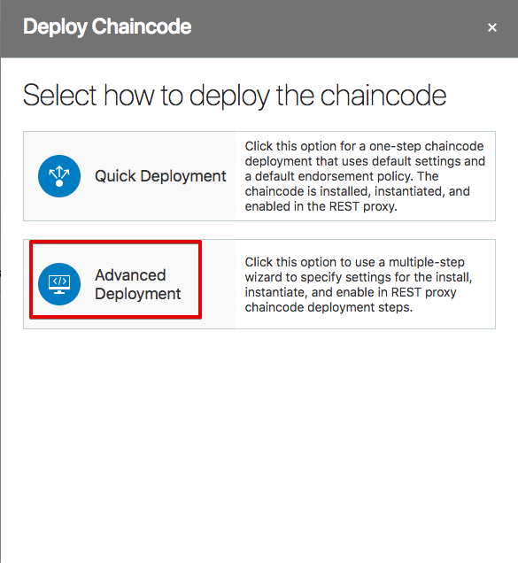
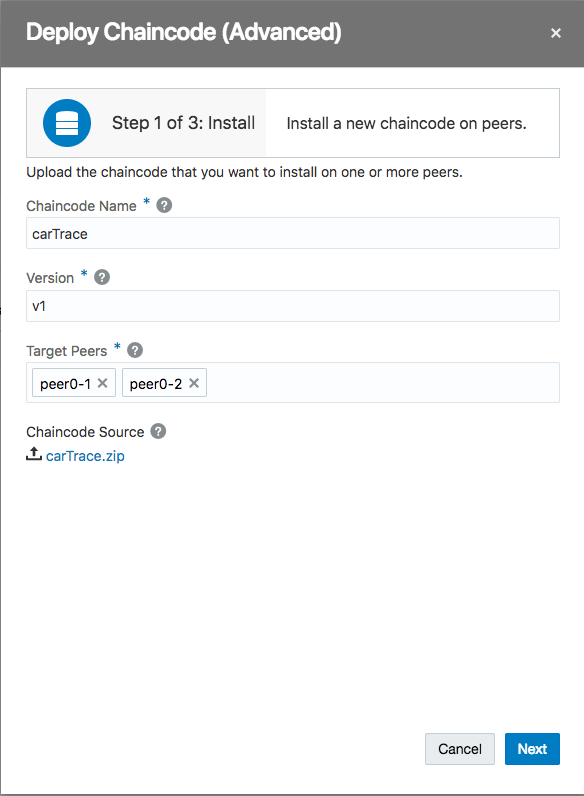

체인 코드를 Peer에 설치하려면 "Next"를 클릭하십시오. 성공 메시지가 나오게 되면, 체인 코드를 '인스턴스화'하라는 메시지가 나타나게 되는데, 이 단계는 체인 코드를 실행되는 채널에 넣는 단계입니다. 

이 단계에서 다음을 수행해야 합니다.

* 체인 코드를 인스턴스화 할 채널을 선택하십시오.
* 채널에 참여할 로컬 Peer를 선택하십시오.
* 보통은 기본 endorse 정책이 적절할 수도 있지만, 여기서는 거래가 2 개의 조직 중 2 개가 서명해야하는 정책을 선택합니다.
* initial parameter 변수는 기본값으로 남겨 두어야 합니다. 이 특정 체인 코드는 매개 변수를 요구하거나 사용하지 않으며 일시적인 맵이 필요 없습니다.

그런 다음 '다음'을 클릭하십시오. 이 과정은 다소 시간이 걸립니다.
체인 코드를 인스턴스화 한 후에 REST 프록시를 통해 체인 코드를 노출할 수 있습니다. 이 단계는 선택 사항인데, 지금은 그냥 완료하도록 하겠습니다. 구성한 endorsement 정책으로 인해 이 설정을 나중에 변경해야 합니다.
체인 코드를 노출하기 위해 REST 프록시를 선택합니다. 여러개가 만들어져 있는데, restproxy1을 선택합니다. 체인 코드가 deploy된 peer 들을 선택합니다.

체인 코드는 이제 설정되었고, Founder 인 Detroit Auto의 samchannel에서 실행됩니다. 
두 번째 채널인 judechannel에서도 이 체인 코드를 실행하려면 수동으로 인스턴스화 해야 합니다. 이렇게 하려면 설치된 carTrace를 확장하고 설치된 버전 (v1)에 대한 햄버거 메뉴를 클릭 한 다음 Instantiate를 선택하십시오.

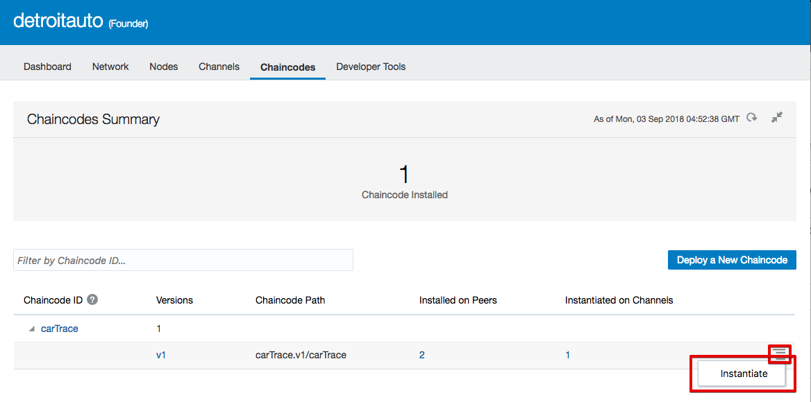

이 화면에서 두 번째 채널을 선택하고 두 피어를 추가 한 다음 이전과 같이 endorsement 정책을 구성합니다.

 "인스턴스화"를 클릭하십시오. 이 프로세스에는 다소 시간이 걸릴 수 있습니다.

1. Participant에 체인코드 인스톨과 초기화 
   
Participant의 각 콘솔에서 "Chaincodes" 탭으로 이동하십시오. 이번에는 체인 코드를 배포 할 때 체인 코드가 이미 Founder에 의해 채널에서 인스턴스화 되었으므로 Peer에 체인 코드만 설치하면 됩니다. 이렇게 하려면 체인 코드 배포의 'Advanced'모드를 한 번 더 사용합니다.
"Install Chaincode" 단계에서 동일한 체인 코드 zip 파일을 업로드하십시오. 체인 코드의 이름과 버전이 Founder 에서 제공 한 이름과 동일하고 이 Org의 Peer 각각이 "Target Peers" 선택 항목에 포함되어 있는지 확인하십시오. 

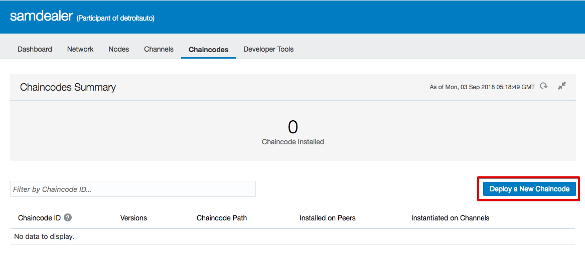

인스턴스화는 Org 나 peer가 아닌 채널에 종속되기 때문에, 일단 체인 코드가 설치되면 인스턴스화 할 필요가 없습니다.  
"Close" 버튼을 눌러 체인 코드 인스턴스화 단계에서 취소하십시오. 

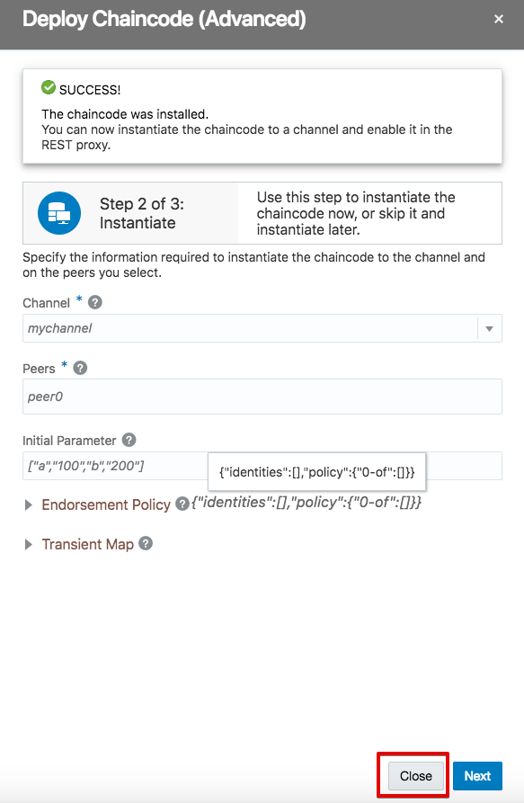

체인 코드 이름 옆에 있는 작은 화살표를 클릭하여 체인 코드 항목을 확장하고 이미 인스턴스화 된 채널이 있음을 확인할 수 있습니다.

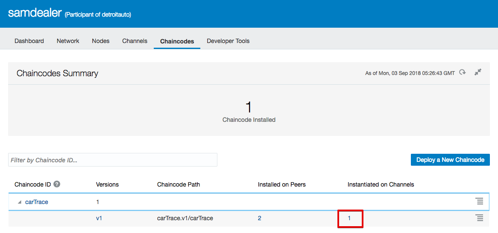

JudeDealer 에 대해서도 동일하게 체인코드를 deploy 합니다.

2. Peer정보 다시 Export하기

체인 코드를 노출시키기 위해서는, 이 체인 코드가 Participant의 peer에서 사용 가능하다는 것을 Founder Org에게 알려주어야 합니다. 이렇게 하려면 노드 탭에서 'Export / Import' 버튼을 클릭해서 Participant의 Peer를 내보내는 방법으로 노드 정보를 한 번 더 내보내야 합니다.
노드 정보가 export되면, Founder의 Node 탭 에서 "Export / Import "버튼과 "Import "옵션을 통해 가져올 수 있습니다.

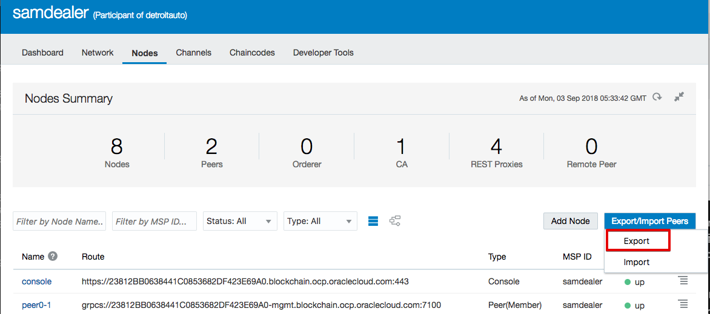

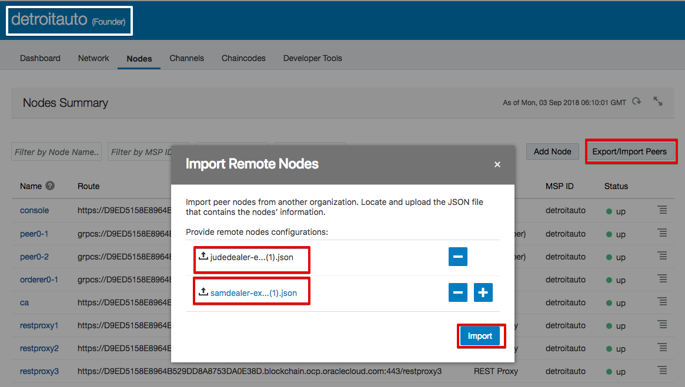

참고 : 이 Lab에서는 두번 Export를 했는데, 처음에 채널에 Join하고 나서와 여기에서 입니다. 첫 번째 내보내기 / 가져 오기는 필요하지 않으며 네트워크 토폴로지의 유효성 검사를 하기 위한 것입니다.
Participant 노드 정보를 Founder로 가져온 후 위의 지침에 따라 Founder의 노드 정보를 각 Participant에게 내보내야 합니다.

3. Gateway 구성
   
Blockchain Cloud 서비스에는 REST Proxy가 포함되어 있어 모든 HTTP 클라이언트에서 체인 코드 기능에 간단하게 액세스 할 수 있습니다. 
체인 코드 배포 프로세스로 인해 REST 프록시를 통해 외부에서 체인 코드를 사용할 수 있게 되었지만, 앞에서 우리는 여러 Org에서 트랜잭션을 Endorsement 해야 한다고 지정했는데, 이 작업은 REST Proxy에서 default로 자동으로 설정되지 않습니다. 이를 위해서는 Proxy Configuration에서 피어 노드를 포함하도록 업데이트 해야 합니다.
Nodes 탭으로 이동하여 RestProxy 노드 4개 중에서 RestProxy 1을 사용했습니다. 햄버거 메뉴를 사용하여 "Edit Configuration"을 클릭하십시오. 

SamDealer의 peer를 samchannel 구성에 추가 한 다음 더하기 버튼을 클릭하여 judechannel에서 실행중인 체인 코드를 노출합니다 (최종 구성은 아래와 같습니다). 변경 사항을 Submit하여 REST 프록시에 노출된 체인 코드 및 채널을 업데이트 하십시오.

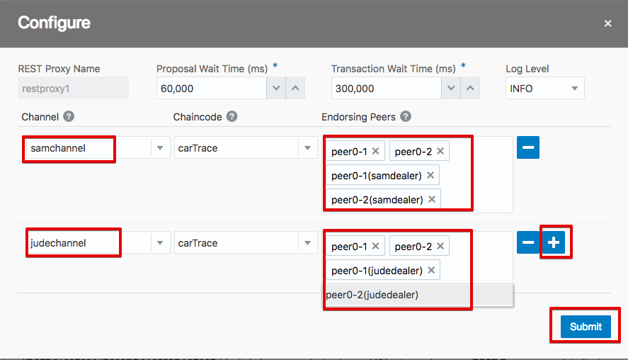

### B. Sample Web Application 준비하기

1. Ledger 초기화

Oracle ABCS에서는 REST API를 통해 체인코드를 호출할 수 있습니다.
Transaction을 호출하는 REST API의 형식은 다음과 같습니다.
<pre><code>
POST https://RESTAPI주소/bcsgw/rest/v1/transaction/invocation 

Headers: 
Content-Type: application/json

Body: {
   "channel":"<channel_name>", 
   "chaincode":"<chaincode_name>", 
   "method":"<function_name>", 
   "args":[<arguments as an array>], 
   "chaincodeVer":"<chaincode_version>"
}
</code></pre>
이를 사용해서 샘플 Application의 데이터를 초기화하는 과정을 진행하도록 하겠습니다.

체인 코드가 업로드 되어 인스턴스화 되었으며 REST 게이트웨이를 통해 원격으로 호출 될 수 있으므로 체인 코드 기능을 호출하고 원장을 쿼리 할 수 있습니다. 원장은 현재 완전히 비어 있으므로 의미있는 데이터를 얻기 위해 장부에 샘플 데이터를 추가하도록 하겠습니다.

이번 Lab에서는 Postman툴([다운로드](https://www.getpostman.com/apps))을 통해 REST API들을 자동화해서 호출하는 방식으로 하게 됩니다.

먼저 detroitauto(Founder)에서 REST Proxy주소를 복사해 둡니다. 아래 그림에서 가운데 붉은색으로 표시된 부분만 복사를 합니다. 

데이터를 초기화하는 Postman 스크립트 파일은 아래의 주소에서 다운로드 합니다.

[OBCS_Workshop.postman_collection.json](https://github.com/OracleCloudKr/Blockchain_Workshop/raw/master/CarDealerLab/artifacts/OBCS_Workshop.postman_collection.json)

[WORKSHOP_ENV.postman_environment.json](https://github.com/OracleCloudKr/Blockchain_Workshop/raw/master/CarDealerLab/artifacts/WORKSHOP_ENV.postman_environment.json)

위 2개의 json 파일 중 WORKSHOP_ENV.postman_environment.json을 여십시오.
그 중에서 아래에 value중 굵게 표시된 부분을 각자의 환경에 맞도록 수정합니다.
<pre>
<code>
    {
      "key": "resturl",
      "value": "<b>xxxxxxxxxxxx</b>.blockchain.ocp.oraclecloud.com/restproxy1",
      "description": "",
      "enabled": true
    },
    {
      "key": "cloudaccount",
      "value": "<b>username@xxxx.com</b>",
      "description": "",
      "enabled": true
    },
    {
      "key": "cloudpwd",
      "value": "<b>xxxxxx</b>",
      "description": "",
      "enabled": true
    }
</code>
</pre>
먼저 Postman을 실행한 후 import 버튼을 눌러 창을 띄우고, 위 두 개의 파일을 import 합니다.

오른쪽 상단의 WORKSHOP_ENV 를 선택해서 환경파일을 적용합니다.
아래 그림과 같이 OBCS_Workshop이라고 하는 Collection이 만들어지고 Http Requests들이 모두 import 된 것을 확인합니다. 이 요청들을 모두 실행하기 위해 왼쪽 상단에 있는 Runner 버튼을 누릅니다.

OBCS_Workshop을 선택하고, Environment에서 WORKSHOP_ENV 를 선택한 후 아래에 있는 RUN 버튼을 클릭합니다.

모든 요청들이 설정한 OABCS의 Founder쪽 REST API 서버로 들어가게 됩니다.
이 요청들은 샘플 App을 위하여 Ledger의 초기데이터를 적재하는 API들을 호출하게 됩니다.

1. Sample Web App 배포
CarTrace Ledger를 호출하기 위한 Sample Web Application 3개를 Founder와 participant 별로 각각 필요합니다.
먼저 아래의 링크에서 다운로드 받으세요.

[jude_web.zip](https://github.com/OracleCloudKr/Blockchain_Workshop/raw/master/CarDealerLab/artifacts/jude_web.zip)

[founder_web.zip](https://github.com/OracleCloudKr/Blockchain_Workshop/raw/master/CarDealerLab/artifacts/founder_webapp.zip)

[sam_web.zip](https://github.com/OracleCloudKr/Blockchain_Workshop/raw/master/CarDealerLab/artifacts/sam_web.zip)

각각 압축을 푸신후에 config.json을 아래와 같이 수정합니다.
아래와 같이 굵게 표시된 부분(gw_endpoint, username, password)을 각자의 환경에 맞게 수정합니다.
<pre></code>
{
  "logger": {
    "appenders": [
      {
        "type": "console",
        "makers": {}
      }
    ],
    "levels": {
      "[all]": "DEBUG"
    }
  },
  "gw_endpoint": "https://<b>xxxxxxxxxxxx</b>.blockchain.ocp.oraclecloud.com:443",
  "channel": "detroit-auto-channel",
  "chaincode_name": "carTrace",
  "chaincode_ver": "v1",
  "username": "<b>username@xxx.com</b>",
  "password": "<b>xxxxxx</b>",
  "title": "Detroit Autos",
  "configurable": false,
  "server_port": 8080,
  "channel_mapping": {
    "detroit-auto-channel": ["samchannel","judechannel"]
  }
}
</code></pre>

다시 zip으로 압축을 합니다.
이 Sample Application은 Node.js로 작성되었으며 Oracle Application Container에 배포할 수 있도록 설정파일인 manifest.json를 포함하고 있습니다.

3개 회사의 각 application을 배포하도록 하기 위해 Oracle Cloud Dashboard의 상단의 햄버거 모양을 클릭한 후 왼쪽 메뉴에서 Application Container를 클릭합니다.

Create Application을 클릭합니다.

제공하는 여러 가지 언어 중 Node를 선택합니다.

Name을 detroit라고 한 후 Application에서 파일 선택 버튼을 누른 후 로컬에 준비한 founder_webapp.zip 을 선택합니다. 
Instances는 Load Balancing을 위해 기본적으로 2개의 인스턴스가 생성이 되는데, 여기서는 1개로 설정을 낮추겠습니다. 이제 Create번을 눌러 생성합니다. 이제 몇분 정도 기다리면 Application이 준비가 되게 됩니다.
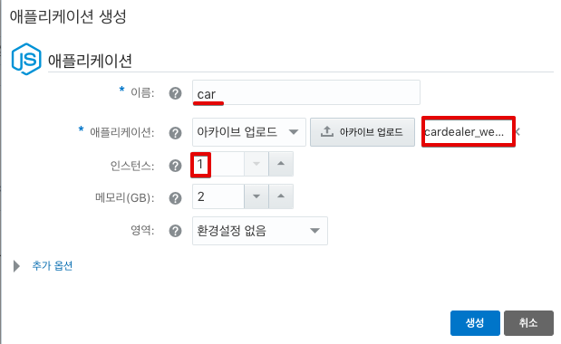
바로 두번째 Application을 만들어 보겠습니다. 이번에는 딜러사인 sam과 jude 회사를 위한 sample application을 생성합니다.

위의 step과 동일하게 각각 생성합니다.

모두 생성이 되게 되면 아래와 같이 나오게 되고, 아래 붉은 색으로 되어 있는 URL을 클릭하면 바로 web application에 접근할 수 있습니다. 각 링크를 눌러서 화면이 정상적으로 뜨는지 확인해보시기 바랍니다.

2. Sample Web App 실행
위에서 생성한 Application들의 console을 클릭해서 각각의 App을 엽니다.
이 App들은 제조업체인 Detroit와 파트너업체인 Sam, Jude에서 사용하는 Vehicle Trace Dashboard입니다. 이 App은 각각 Org의 Chaincode에 접근해서 해당 채널에 배포된 Ledger로 부터 Query를 해오고, 다른 업체로 부품을 전달하는 Transaction을 수행할 수 있는 기능을 제공합니다.

3. Blockchain Query하기
딜러들은 거래를 제조업체와 공유하는 비공개 채널로 푸시합니다. "carTrace"이라는 Smart Contract에 의해 실행됩니다.
이 Smart Contract은 컨소시엄의 허가된 원장에 대한 모든 상태를 관할합니다. 해당 대리점의 "차량 추적 대시 보드"를 열고 포함된 부품 및 차량을 쿼리 할 때 사용하십시오.

Sam's Dealership에서 다음 정보를 넣고 쿼리를 해보세요. 

참고 : 쉼표 ","를 사용하여 쿼리 필드에서 한 번에 여러 항목을 검색 할 수 있습니다.

에어백 일련 번호:
~~~
abg1234, abg1235
~~~

차량 번호:
~~~
dtrt10001, dtrt10002
~~~

위의 쿼리를 Jude의 대시 보드에서 수행하면 채널 프라이버시로 인해 결과가 조회되지 않습니다.

다음은 Jude 's Dealership 다음 정보를 넣고 쿼리를 해보세요. 
VehiclePart 일련 번호 : 
~~~
whl1241, win1242
~~~

Detroit Auto 샘플 애플리케이션에서는 모든 쿼리를 실행할 수 있습니다.

그리드에서 항목을 선택하면 해당 기록이 표시됩니다. 트랜잭션을 선택하면 항목의 내역 상태가 자세히 표시됩니다.

참고 : 그래프에는 현재 시간보다 45 일 이내에 실행된 트랜잭션만 표시됩니다. 최근 거래를 보려면 그래프의 현재 날짜로 스크롤해야 할 수 있습니다.

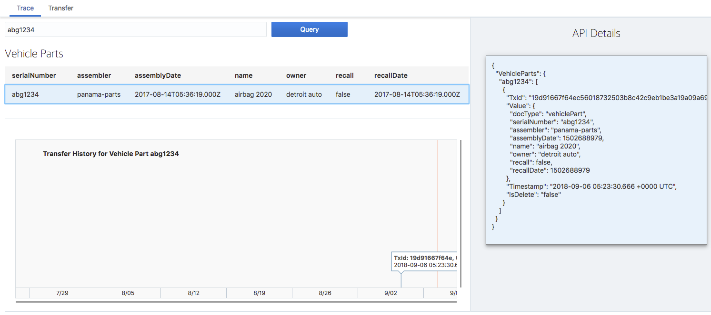

4. Transaction 실행하기

"Vehicle Trace Dashboard"를 열고 "transfer"탭을 선택하여 트랜잭션을 실행하십시오. "Sam의 Dealership"에서 "Detroit Auto"로 차량번호 "dtrt10001"를 전송해 보겠습니다.

사용자 이름 "SamDealer"와 아무 비밀번호나 넣고 로그인하십시오.
차량 번호로 "dtrt10001"을 입력하십시오(Chassis number of a vehicle). Vehicle new owner로 "DetroitAuto"를 입력하십시오. 그런 다음 "Transfer Vehicle"버튼을 클릭하십시오.

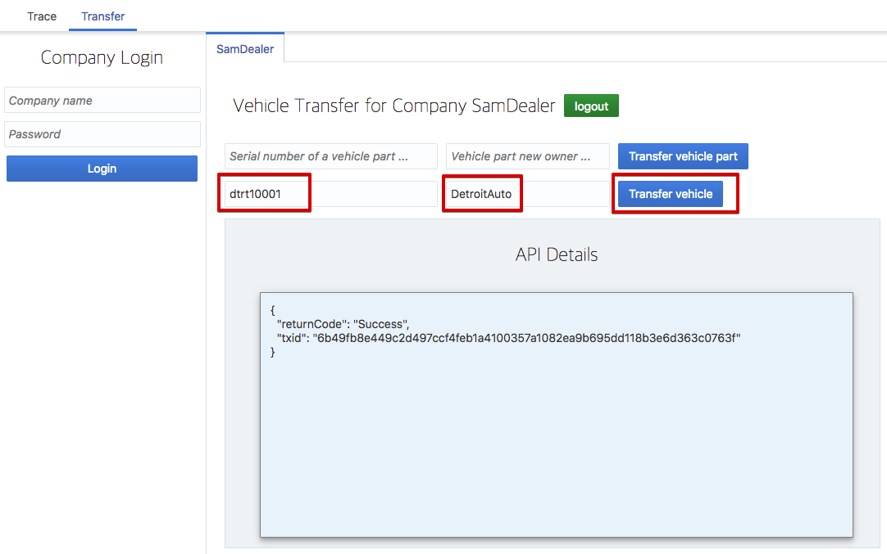

다시 Trace 탭으로 이동해서 dtrt10001 를 조회해서 해당 차량의 Transaction History를 확인할 수 있습니다. 오른쪽의 API Details에서와 같이 API호출시에 JSON 형태로 History 데이터가 반환되는 것을 확인할 수 있습니다.

5. REST API를 통해 Transaction 실행

CarTrace의 모든 트랜잭션과 결과들은 REST API로 호출할 수 있습니다.
REST 호출을 실행할 때 두 가지 옵션이 있습니다.
- PostMan과 같은 Tool 사용
- 터미널에서 "curl" 명령 사용

PostMan은 앞서 기초 데이터를 넣을 때 이미 사용했습니다.
이미 배포된 곳에 Query를 위한 샘플용 request가 들어 있습니다.
왼쪽 request들 가장 아래 부분에 Query Vehicle 이라는 request를 선택하십시오.

오른쪽 입력파라미터 중 args로 위에서 사용한 차량번호 dtrt10001를 입력합니다.
send를 누르면 결과가 차량 history에 대한 결과가 json 형태로 반환됩니다.

위 결과는 curl 명령어를 사용해도 동일한 결과를 얻을 수 있습니다.