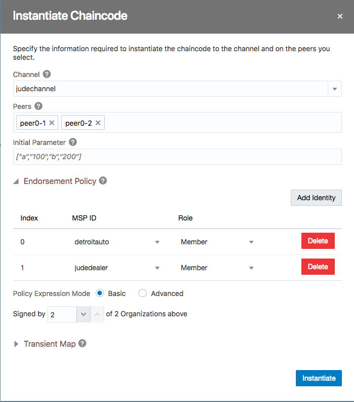
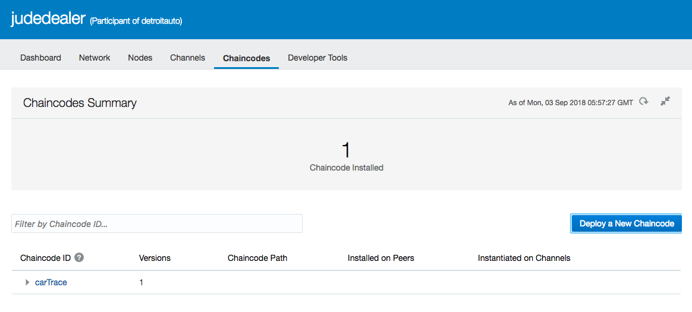

# 체인코드 배포하기

지금까지 네트워크를 구축했지만 아직 아무것도 하지 않았습니다. Chaincode는 블록체인 위에서 돌아가는 코드 입니다. Chaincode에서는 데이터 유형을 정의하고, 트랜잭션을 어떻게 실행할지에 대한 로직을 정의하고, 실행되는 조건을 검증하게 됩니다. Chaincode는 응용 프로그램에서 실행하는 트랜잭션을 통해 원장 상태를 초기화 하고 관리합니다. 체인 코드는 일반적으로 네트워크 구성원이 동의한 비즈니스 로직을 처리하므로 "Smart Contract" 이라고도 합니다.

Chaincode는 golang (GO로도 알려짐)으로 작성되었지만, golang에 익숙하지 않은 경우 너무 걱정하지 않아도 됩니다. 이 데모에서는 chaincode carTrace.zip를 제공합니다.

[carTrace.zip 다운로드](https://github.com/OracleCloudKr/Blockchain_Workshop/raw/master/CarDealerLab/artifacts/carTrace.zip)

### 1. Founder에 체인코드 인스톨 & 초기화 
   
체인 코드를 설치하려면 Founder Org의 콘솔에서 **Chaincodes**탭으로 이동 한 다음 **Deploy a New Chaincode** 버튼을 클릭하십시오. 여기에서 로컬 컴퓨터에서 가져 오거나, 자동화 된 빌드 프로세스의 마지막 단계인 Rmote URL을 참조하여 체인 코드를 업로드 할 수 있습니다.

체인 코드를 설치하는 데는 두 가지 옵션이 있습니다. 한 번 클릭으로 체인 코드를 설정하고 여러 가지 기본값을 포함하도록 설계된 **Quick Deploy** 또는 체인 코드 설정 프로세스에 대한 보다 세부적인 제어를 위한 고급 옵션이 있습니다.

이 Lab에서는 **고급 옵션**을 사용하여 프로세스를 단계별로 수행하고 각 설정의 의미를 설명하지만 대부분의 개발 시나리오에서 빠른 배포로 하시면 됩니다.

고급 체인 코드 배포의 첫 번째 단계에서는 연관된 peer 각각에 체인 코드를 설치합니다. 이를 위해 우리는 chaincode 이름 (여기서 우리는 **carTrace**를 사용하고 있습니다), 버전 (**v1**) 그리고 어느 피어를 배포 할 것 인지를 입력 할 수 있습니다. 이 경우 모든 peer에게 배포 할 예정이지만, Transaction을 검증하는 peer와 Ledger 사본을 단순히 저장하는 peer가 있습니다. (빠른 배포는 모든 peer에게 배포됩니다). chaincode가 들어있는 제공된 carTrace.zip의 사본을 업로드 할 수도 있습니다.

    주의 : 체인 코드가 설치된 모든 Org에서 유일하게 유지되므로 체인 코드 이름에 주의하십시오.

첫 번째 화면은 다음과 같이 나오게 됩니다.

> Chaincode Name : **carTrace**  
> Version : **v1**  
> Target Peers : peer0-1, peer0-2 

체인 코드를 Peer에 설치하려면 **Next**를 클릭하십시오. 
    
성공 메시지가 나오게 되면, 체인 코드를 '인스턴스화'하라는 메시지가 나타나게 되는데, 이 단계는 체인 코드를 실행되는 채널에 넣는 단계입니다. 

이 단계에서 다음을 수행해야 합니다.

* 체인 코드를 인스턴스화 할 채널을 선택하십시오.
* 채널에 참여할 로컬 Peer를 선택하십시오.
* 보통은 기본 endorse 정책이 적절할 수도 있지만, 여기서는 거래가 2 개의 조직 중 2 개가 서명해야하는 정책을 선택합니다.
* **initial parameter 변수는 기본값으로 남겨 두어야 합니다**. 이 특정 체인 코드는 매개 변수를 요구하거나 사용하지 않으며 일시적인 맵이 필요 없습니다.

~~~
[Endorsement Policy]
Endorsement(검증) 를 어느 Org, 어느 peer에서 할 것인지를 선택하는 과정입니다. 여기에서 MSP가 detroitauto와 samdealer로 선택을 하게 되면, 두 개의 Org에서 모두 검증(endorse)를 하게 됩니다. 
이 검증을 수행할 때 Siged by 2 of 2 Organizations above 는 2개의 Org중 2개가 검증에 통과하면 성공을 의미한다고 하는 설정입니다.|
~~~
       
그런 다음 **다음**을 클릭하십시오. 이 과정은 다소 시간이 걸립니다.

체인 코드를 인스턴스화 한 후에 REST 프록시를 통해 체인 코드를 노출할 수 있습니다. 이 단계는 선택 사항인데, 지금은 그냥 완료하도록 하겠습니다. 구성한 endorsement 정책으로 인해 이 설정을 나중에 변경해야 합니다.

체인 코드를 노출하기 위해 REST 프록시를 선택합니다. 여러개가 만들어져 있는데, restproxy1을 선택합니다. 체인 코드가 deploy된 peer 들을 선택합니다.

체인 코드는 이제 설정되었고, Founder 인 Detroit Auto의 **samchannel**에서 실행됩니다. 

두 번째 채널인 **judechannel**에서도 이 체인 코드를 실행하려면 수동으로 인스턴스화 해야 합니다. 이렇게 하려면 설치된 carTrace를 확장하고 설치된 버전 (v1)에 대한 햄버거 메뉴를 클릭 한 다음 **Instantiate**를 선택하십시오.

이 화면에서 두 번째 채널을 선택하고 두 피어를 추가 한 다음 이전과 같이 endorsement 정책을 구성합니다.

**인스턴스화(Instantiate)** 를 클릭하십시오. 이 프로세스에는 다소 시간이 걸릴 수 있습니다.

### 2. Participant에 체인코드 인스톨과 초기화 
   
Participant의 각 콘솔에서 **Chaincodes** 탭으로 이동하십시오. 이번에는 체인 코드를 배포 할 때 체인 코드가 이미 Founder에 의해 채널에서 인스턴스화 되었으므로 Peer에 체인 코드만 설치하면 됩니다. 이렇게 하려면 체인 코드 배포의 **Advanced** 모드를 한 번 더 사용합니다.

**Install Chaincode** 단계에서 동일한 체인 코드 zip 파일을 업로드하십시오. 체인 코드의 이름과 버전이 Founder 에서 제공 한 이름과 동일하고 이 Org의 Peer 각각이 "Target Peers" 선택 항목에 포함되어 있는지 확인하십시오. 

인스턴스화는 Org 나 peer가 아닌 채널에 종속되기 때문에, 일단 체인 코드가 설치되면 인스턴스화 할 필요가 없습니다.  
**Close** 버튼을 눌러 체인 코드 인스턴스화 단계에서 취소하십시오. 

체인 코드 이름 옆에 있는 작은 화살표를 클릭하여 체인 코드 항목을 확장하고 이미 인스턴스화 된 채널이 있음을 확인할 수 있습니다.

### 3. JudeDealer 에 대해서도 동일하게 체인코드를 deploy 합니다. 
위 2번 과정을 judedealer 콘솔에서 동일하게 수행합니다.

### 4. Peer정보 다시 Export하기

체인 코드를 노출시키기 위해서는, 이 체인 코드가 Participant의 peer에서 사용 가능하다는 것을 Founder Org에게 알려주어야 합니다. 이렇게 하려면 노드 탭에서 **Export / Import** 버튼을 클릭해서 Participant의 Peer를 내보내는 방법으로 노드 정보를 한 번 더 내보내야 합니다.

노드 정보가 export되면, Founder의 Node 탭 에서 **Export / Import** 버튼과 **Import** 옵션을 통해 가져올 수 있습니다.

> 참고 : 이 Lab에서는 두번 Export를 했는데, 처음에 채널에 Join하고 나서 한번 체인코드 배포 후 한번 이렇게 두번입니다. 첫 번째 내보내기 / 가져 오기는 반드시 필요한 것은 아니며 네트워크 토폴로지의 유효성 검사를 하기 위한 한번 미리 해본 것입니다.
Participant 노드 정보를 Founder로 가져온 후 위의 지침에 따라 Founder의 노드 정보를 각 Participant에게 내보내야 합니다.

### 5. Gateway 구성
   
Blockchain Cloud 서비스에는 REST Proxy가 포함되어 있어 모든 HTTP 클라이언트에서 체인 코드 기능에 간단하게 액세스 할 수 있습니다. 

체인 코드 배포 프로세스로 인해 REST 프록시를 통해 외부에서 체인 코드를 사용할 수 있게 되었지만, 앞에서 우리는 여러 Org에서 트랜잭션을 Endorsement 해야 한다고 지정했는데, 이 작업은 REST Proxy에서 default로 자동으로 설정되지 않습니다. 이를 위해서는 Proxy Configuration에서 피어 노드를 포함하도록 업데이트 해야 합니다.

Founder 콘솔의 **Nodes** 탭으로 이동하여 RestProxy 노드 4개 중에서 RestProxy1의  햄버거 메뉴를 사용하여 **Edit Configuration**을 클릭하십시오. 

SamDealer의 peer를 samchannel 구성에 추가 한 다음 더하기 버튼을 클릭하여 judechannel에서 실행중인 체인 코드를 노출합니다 (최종 구성은 아래와 같습니다). 
    
변경 사항을 Submit하여 REST 프록시에 노출된 체인 코드 및 채널을 업데이트 하십시오.

---

[이전 Lab으로 이동](README.md)
