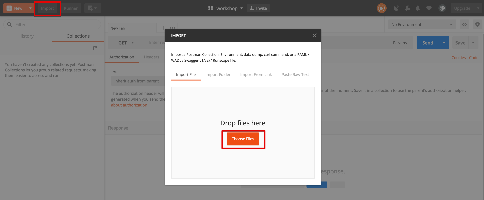
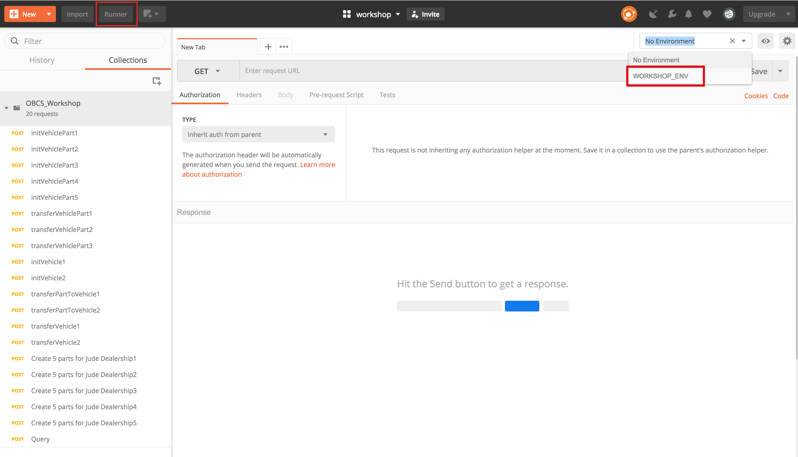
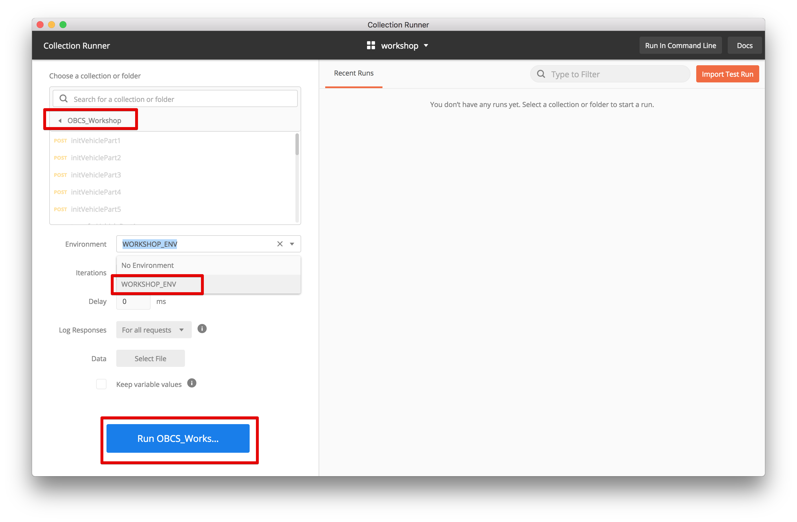
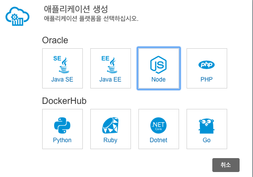
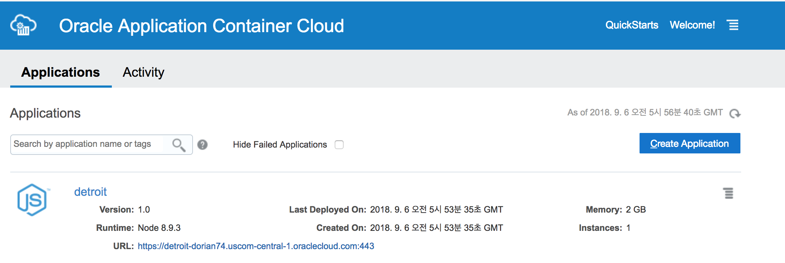

# Sample Web Application 준비하기

### A. Ledger 초기화

Oracle ABCS에서는 REST API를 통해 체인코드를 호출할 수 있습니다.
Transaction을 호출하는 REST API의 형식은 다음과 같습니다.
<pre><code>
POST https://RESTAPI주소/bcsgw/rest/v1/transaction/invocation 

Headers: 
Content-Type: application/json

Body: {
   "channel":"<channel_name>", 
   "chaincode":"<chaincode_name>", 
   "method":"<function_name>", 
   "args":[<arguments as an array>], 
   "chaincodeVer":"<chaincode_version>"
}
</code></pre>
이를 사용해서 샘플 Application의 데이터를 초기화하는 과정을 진행하도록 하겠습니다.

체인 코드가 업로드 되어 인스턴스화 되었으며 REST 게이트웨이를 통해 원격으로 호출 될 수 있으므로 체인 코드 기능을 호출하고 원장을 쿼리 할 수 있습니다. 원장은 현재 완전히 비어 있으므로 의미있는 데이터를 얻기 위해 장부에 샘플 데이터를 추가하도록 하겠습니다.

이번 Lab에서는 Postman툴([다운로드](https://www.getpostman.com/apps))을 통해 REST API들을 자동화해서 호출하는 방식으로 하게 됩니다.

1. 먼저 detroitauto(Founder)에서 REST Proxy주소를 복사해 둡니다. 
   아래 그림에서 가운데 붉은색으로 표시된 부분만 복사를 합니다. 
    

1. 데이터를 초기화하는 Postman 스크립트 파일은 아래의 주소에서 다운로드 합니다.

    [OBCS_Workshop.postman_collection.json](https://github.com/OracleCloudKr/Blockchain_Workshop/raw/master/CarDealerLab/artifacts/OBCS_Workshop.postman_collection.json)

    [WORKSHOP_ENV.postman_environment.json](https://github.com/OracleCloudKr/Blockchain_Workshop/raw/master/CarDealerLab/artifacts/WORKSHOP_ENV.postman_environment.json)

1. 위 2개의 json 파일 중 WORKSHOP_ENV.postman_environment.json을 여십시오.
    그 중에서 아래에 value중 굵게 표시된 부분을 각자의 환경에 맞도록 수정합니다.
    <pre>
    <code>
        {
        "key": "resturl",
        "value": "<b>xxxxxxxxxxxx</b>.blockchain.ocp.oraclecloud.com/restproxy1",
        "description": "",
        "enabled": true
        },
        {
        "key": "cloudaccount",
        "value": "<b>username@xxxx.com</b>",
        "description": "",
        "enabled": true
        },
        {
        "key": "cloudpwd",
        "value": "<b>xxxxxx</b>",
        "description": "",
        "enabled": true
        }
    </code>
    </pre>
1. 먼저 Postman을 실행한 후 import 버튼을 눌러 창을 띄우고, 위 두 개의 파일을 import 합니다.

    

1. 오른쪽 상단의 WORKSHOP_ENV 를 선택해서 환경파일을 적용합니다.
   아래 그림과 같이 OBCS_Workshop이라고 하는 Collection이 만들어지고 Http Requests들이 모두 import 된 것을 확인합니다. 이 요청들을 모두 실행하기 위해 왼쪽 상단에 있는 Runner 버튼을 누릅니다.

1. OBCS_Workshop을 선택하고, Environment에서 WORKSHOP_ENV 를 선택한 후 아래에 있는 RUN 버튼을 클릭합니다.

1. 모든 요청들이 설정한 OABCS의 Founder쪽 REST API 서버로 들어가게 됩니다.
   
   이 요청들은 샘플 App을 위하여 Ledger의 초기데이터를 적재하는 API들을 호출하게 됩니다.

### B. Sample Web App 배포
CarTrace Ledger를 호출하기 위한 Sample Web Application 3개를 Founder와 participant 별로 각각 필요합니다.
1. 먼저 아래의 링크에서 다운로드 받으세요.

    [jude_webapp.zip](https://github.com/OracleCloudKr/Blockchain_Workshop/raw/master/CarDealerLab/artifacts/jude_webapp.zip)

    [founder_webapp.zip](https://github.com/OracleCloudKr/Blockchain_Workshop/raw/master/CarDealerLab/artifacts/founder_webapp.zip)

    [sam_webapp.zip](https://github.com/OracleCloudKr/Blockchain_Workshop/raw/master/CarDealerLab/artifacts/sam_webapp.zip)

1. 각각 압축을 푸신후에 config.json을 아래와 같이 수정합니다.

    아래와 같이 굵게 표시된 부분(gw_endpoint, username, password)을 각자의 환경에 맞게 수정합니다.
    <pre></code>
    {
    "logger": {
        "appenders": [
        {
            "type": "console",
            "makers": {}
        }
        ],
        "levels": {
        "[all]": "DEBUG"
        }
    },
    "gw_endpoint": "https://<b>xxxxxxxxxxxx</b>.blockchain.ocp.oraclecloud.com:443",
    "channel": "detroit-auto-channel",
    "chaincode_name": "carTrace",
    "chaincode_ver": "v1",
    "username": "<b>username@xxx.com</b>",
    "password": "<b>xxxxxx</b>",
    "title": "Detroit Autos",
    "configurable": false,
    "server_port": 8080,
    "channel_mapping": {
        "detroit-auto-channel": ["samchannel","judechannel"]
    }
    }
    </code></pre>

2. 다시 zip으로 압축을 합니다.
    이 Sample Application은 Node.js로 작성되었으며 Oracle Application Container에 배포할 수 있도록 설정파일인 manifest.json를 포함하고 있습니다.

1. 3개 회사의 각 application을 배포하도록 하기 위해 Oracle Cloud Dashboard의 상단의 햄버거 모양을 클릭한 후 왼쪽 메뉴에서 Application Container를 클릭합니다.

1. Create Application을 클릭합니다.

1. 제공하는 여러 가지 언어 중 Node를 선택합니다.

1. Name을 detroit라고 한 후 Application에서 파일 선택 버튼을 누른 후 로컬에 준비한 founder_webapp.zip 을 선택합니다. 
   
   Instances는 Load Balancing을 위해 기본적으로 2개의 인스턴스가 생성이 되는데, 여기서는 1개로 설정을 낮추겠습니다. 이제 Create번을 눌러 생성합니다. 이제 몇분 정도 기다리면 Application이 준비가 되게 됩니다.
    

2. 바로 두번째 Application을 만들어 보겠습니다. 이번에는 딜러사인 sam과 jude 회사를 위한 sample application을 생성합니다.

1. 위의 step과 동일하게 각각 생성합니다.

1. 모두 생성이 되게 되면 아래와 같이 나오게 되고, 아래 붉은 색으로 되어 있는 URL을 클릭하면 바로 web application에 접근할 수 있습니다. 각 링크를 눌러서 화면이 정상적으로 뜨는지 확인해보시기 바랍니다.

---
[이전 Lab으로 이동](README.md)